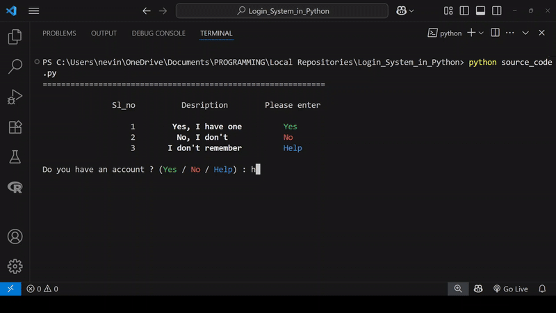

# Secure Login with 2FA in 🐍
   <br>
[](https://git.io/typing-svg)
## Project Description
This project is an attempt to build a **secure login system in Python** that implements top - tier security measures, monitors all login attempts and registration activities, hence preventing any suspected malpractice.

The system ensures: 
- ***Secure account handling*** using hashed passwords and TOTP (RFC 6238) based authentication, and different databases for different activities. 
- ***Logging user activities with timestamps and description*** like registration, successful and failed login attempts.
- ***Dynamic validation*** with measures to block suspicious attempts.
## 🎥Demo video

____
## 📋Table of Contents:
- [Project Description](#project-description)
- [Demo video](#demo-video)
- [Standout Features](#standout-features)
- [Technologies Used](#️technologies-used)
- [Installation and Guidelines (VS Code based)](#installation-and-guidelines-vs-code-based)
- [Usage](#usage)
- [Testing](#testing)
- [Troubleshooting](#️troubleshooting)
- [Acknowledgement](#acknowledgement)
- [References](#references)
- [Further Reading](#further-reading)
- [Contributions](#contributions)
- [License](#license)
- [Author](#author)
----
## 🌟Standout Features
1. **Secure Registration:**
    - Hashes password with `bcrypt` for secure registration. 
    - Prevents duplicate registrations using phone number validations. 
2. **Two - Factor Authentication (2FA):**
    - Generates a unique TOTP (Time-based One Time Password) for login validations. 
    - Displays QR - Code for easy integration with Two Factor Authentication Apps like Google Authenticator, Microsoft Authenticator, etc.
3. **Robust Login System:**
    - Tracks login attempts, including timestamps and statuses. 
    - Locks account after consecutive failed attempts. 
4. **Validations and Error Handling:**
    - Validates inputs like username, phone number, and passwords using regex. 
    - Provides clear error messages and warnings for such invalid inputs. 
5. **Activity Logging:**
    - Logs each user activity into a tracker database, including registration, login success, and failures.
6. **UI/UX Design and User-Friendly Animations:**
    - Includes interactive animation for better user experience, and colour-coded responses for user activities like successful login, failed attempt, and warnings.
----
## 🛠️Technologies Used:
1.  **Python** for core implementations. 
2.  **SQLite** for the database backend. 
### Python modules in the project:
- `bcrypt`: hash passwords securely (hashing + salting).
- `hashlib`: hash phone numbers (SHA-256). 
- `pyotp`: generate and validate TOTP. 
- `qrcode`: generate QR-Code for 2FA.
- `sqlite3`: to connect with SQLite database.
- `re`: implements regular expressions. 
- `datetime`: get the current date, day, time with proper formatting prctices. 
- `sys`: control cursor visibility. 
- `unittest`: automated testing. 

### Database Architecture:
I have implemented three different databases in the project, to ensure data safety.<br>
[N.B: This example data is fictional and meant for illustrative purposes only.]
-  **`main_database.db`**: This database stores the user information like their name, phone number, and hashed password. The password is hashed using the bcrypt hashing method, which adds a layer of salt along with hashing, hence, ensuring data safety. 
    |Sl_no|Username      |Phone Number|Password                                      |
    |-----|--------------|-------------|----------------------------------------------|
    |  1. |George Philip |9656815683   |\$2b\$12\$sYo.nwT5mJcJIUvjdymBeequh6WnamTDHQOaHKp/Po8Qnf2Ctl2BS|
    |  2. |Anu T. Francis|9447921380   |\$2b\$12\$45KJHFKrIum6F8ah4dsUO.nLdy6EbIA.u1MG9iuByXzP/tPAVKMKq|
    |  3. |Joy Thomas    |8547812650   |\$2b\$12\$XtNgHXPdLJPEAdsITt/gfu1ztFyo5uEULSsXA6Ii9qa1CgQeR3/gK|
`<br>
- **`keys.db`**: This database stores the hashed phone numbers and the secret key generated for each registered phone numbers. The phone nnumber must be hashed before storage, ***why*** - every phone number registered will get a unique secret key at the time of it's registration, which means, there is a key for every registered mobile number. When a user attempts to login, this key should be retrieved for validating the TOTP. The only way to identify the secret key is via the phone number. Which means, if the phone number is exposed, one can easily get the corresponding secret key, and so the TOTP. Hashing the phone number will provide extra safety for the secret keys. 
    |Sl_no|  Phone Number                                                 | Key                            |
    |-----|----------------------------------------------------------------|---|
    |  1. |87c5fb21f9ff0070bace9984f4c729398f22ae4490d624a5b914cfcefc7c785f|CS5H2ZQZGLWLGXE4X2TTDJ5XWHQ6EAR7|
    |  2. |ba519536cb32cddcd7284b95850852e241462ab00035f443c2d65044c05176ff|OJY42F2M74PE5NPZZTZ4KOOC73BJ6TUO|
    |  3. |a3e4b61a95fbff395d0991585254e903750a613b2c137b475511c974c622f562|XYKGLRCHB77SYZBDRYRQQLHEL7KJX32E|
    
    <br>
- **`login_tracker.db`**: This database stores the details about user activities like registration and login attempts, along with their status, and description that explains the action. Hence, this database acts like a monitoring system of the user activities. 
    |Sl_no| Username     |Login_Date| Login_Time | Day     |Login_Status| Description                       |
    |-----|--------------|----------|------------|---------|------------|-----------------------------------|
    |  1. |George Philip |2025-06-25|10:26:29  PM|Wednesday|---         |User Registration                  |
    |  2. |Anu T. Francis|2025-06-25|10:27:37  PM|Wednesday|---         |User Registration                  |
    |  3. |George Philip |2025-06-25|10:28:16  PM|Wednesday|Failed      |User enters wrong password thrice consecutively                  |
    |  4. |George Philip |2025-06-25|10:28:52  PM|Wednesday|Failed      |Invalid TOTP entered by the user                  |
    |  5. |George Philip |2025-06-25|10:30:38  PM|Wednesday|Success     |User successfully logged in                  |
    |  6. |Joy Thomas    |2025-06-25|10:40:37  PM|Wednesday|---         |User Registration                  |
    
____
## 📥Installation and Guidelines (VS Code based)
*I strongly recommend using  VS Code for this project, as it simplifies data visualisations and coding workflows.*
#### Pre-requesites:
1. **Install Python and setup VS Code:**
[Click Here](https://www.youtube.com/watch?v=5uYJwwyBCYQ) for a detailed tutorial on installing Python and integrating it with VS Code.
<a id = "install_modules"></a>
2. **Install required Python Modules:**
*Some python modules has to be explicitly installed*, for example, the `bcrypt`, `qrcode`, etc while, some others like `time`, `sys`, are *already included in the core python* (means, they are already installed along with the installation of python software), so you need not install them explicitly. 
You can install the former kind of modules via terminal using the command: 
    ```bash
    pip install bcrypt
    pip install qrcode
    # like this, you should install other modules as needed
    ```
    You may otherwise use the command, 
    ```bash
    pip install -r requirements.txt
    ```

3. **Enabling the SQLite viewer in VS Code:**<a id = "sqlite_viewer"></a>
To view the contents stored in the database, you would need the help of one such database viewer. ***Why*** - because, unlike the source code, the database contents are stored in binary (machine readable) code, and hence, we cannot access it in the same way how we access some source code files. In VS Code, the extension pack named **"SQLite Viewer"** will help you serve the purpose. <br>
Here are the steps to set up the database viewer, 
    - Go to extensions tab in VS Code (or press `Ctrl+Shift+X`).  
    - Search for **"SQLite Viewer"** in the search bar. 
    - Install **"SQLite Viewer"** (by Florian Klampfer), and ensure it's enabled. 
4. **Install Git:**
To clone the repository, you would need Git installed in your device. 
#### Installation steps:
1. **Clone the repository using VS Code terminal:**
- Launch VS Code and open your target folder
- Open integrated terminal ``Ctrl+`(backtick)``
- Run git clone:
    ```bash
    git clone https://github.com/nevinbeno/2FA-Login-in-Python.git
    ```
2. **Direct to the cloned repository:**
Use the command, to get into the folder.
    ```bash
    cd 2FA-Login-in-Python
    ```
3. **Run the Program:**
    ```bash
    python source_code.py
    ```

## 💻Usage
##### **Registration**
- User can register by providing their name, phone number, and a valid password.
##### **Login**
- User can login (only if they have registered) using their registered phone number and password. 
- TOTP validation is needed to complete the login process.
##### **Tracking**
- View logs of user activities in the SQLite tracker database (`login_tracker.db`)
----
## ✅Testing
The project includes unit tests to validate core functionalities like: 
- Password hashing and validation. 
- Name validation. 
- Phone Number validation. 
- User registration and login.

**Run the tests using:**
```bash
python -m unittest discover
```
```
Output : 
..........
----------------------------------------------------------------------
Ran 10 tests in 0.560s

OK
```
----
## ⚠️Troubleshooting
|Issue|Explanation|Solution|
|-----|-----------|--------|
|Module Not Found Error|This error raises when some python modules are not installed in your device|use the command `pip install -r requirements.txt` or `pip install <module_name>` to get all the needed modules. For more details, [Click Here](#install_modules)|
|"Cannot open `.db` files"|This error occurs because, the platform on which you run the code may not support opening the .db files, as it is in binary.|[Click Here](#sqlite_viewer) for the solution|
----
## 📚References
- [bcrypt](https://en.wikipedia.org/wiki/Bcrypt) - wikipedia
- [TOTP (RFC 6238)](https://en.m.wikipedia.org/wiki/Time-based_one-time_password) - wikipedia
- [HOTP (RFC 4226)](https://en.m.wikipedia.org/wiki/HMAC-based_one-time_password) - wikipedia
- [Two-Factor Authentication](https://youtu.be/ZXFYT-BG2So) - YouTube
- [PyOTP](https://github.com/pyauth/pyotp) - GitHub page

## 🔍Further Reading
- [Hash Function](https://en.wikipedia.org/wiki/Hash_function)
- [Multi-Factor Authentication](https://en.wikipedia.org/wiki/Multi-factor_authentication)
----
## Acknowledgement
I would like to express my sincere gratitude to the following individuals and resources for their support and inspiration during the development of this project:
- **Prof. Ajay James**
- **Irshad P. I**
- **Alan Thomas**
- **Arun Anandan**

I would express my gratitude to the **Python community** for providing extensive documentation and open-source tools.

I would also like to expresss my gratitude to the following online resources, which helped me in understanding the working of 2FAs:
- [Computerphile](https://www.youtube.com/@Computerphile) (YouTube channel)
- [NeuralNine](https://www.youtube.com/@NeuralNine) (YouTube channel)
- [2FAS App](https://www.youtube.com/@2FAS) (YouTube channel)
- [PyOTP](https://github.com/pyauth/pyotp) - GitHub page
- [TOTP (RFC 6238)](https://en.m.wikipedia.org/wiki/Time-based_one-time_password) - wikipedia

----

## 🤝Contributions
Contributions are what makes the open source community such an amazing place to learn, inspire, and create. Any contributions you make to this project are **greatly appreciated**.
#### Ways to contribute:
1. Report bugs:
    - If you find a bug, please open an issue with details about the bug and steps to reproduce it. 
    - Use the issue template for structured reporting. 
2. Request Features:
    - If you have some ideas about a new feature for this project, share it by opening a feature request. 
3. Submit Code:
    - Fix a bug, improve existing functionality, or add a new feature. 
    - Follow the steps below to contribute code:
        - Fork the repository. 
        - Create a new branch
            ```bash
            git checkout -b feature-name
            ```
        - Make your changes and commmit them
            ```bash
            git commit -m "Added feature-name"
            ```
        - Open a pull request. 
4. Improve Documentation:
- Found a typo or something unclear in the README ? Submit a pulll request to improve it. 
5. Provide Feedbacks:
- Suggest improvements, point out ineffiiencies, or provide ideas for better user experience. 
#### Contribution Guidelines:
- Please follow the [Code of Conduct](CODE_OF_CONDUCT.md) to maintain a respectful and inclusive environment. 
- Please write clear commit messages and document your changes when submitting a pull request. 
#### Thank you !
___
## 📜License
This project is licensed under the MIT License - See [LICENSE](LICENSE) for details.
___
## 👨‍💻Author
**Nevin Beno**<br>
[LinkedIn](https://www.linkedin.com/in/nevin-beno-2b669833a/) | [GitHub](https://github.com/nevinbeno)<br><br>
 